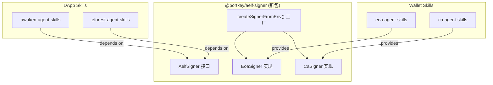
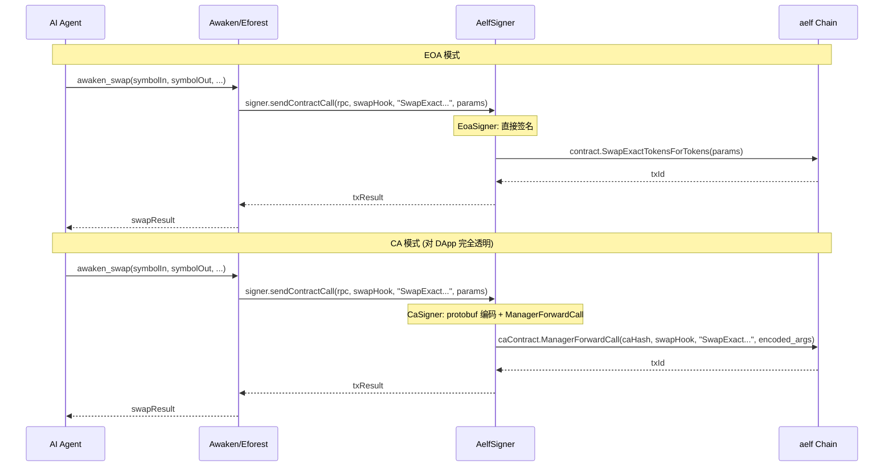

# Unified AelfSigner 统一签名方案

## 一、现状分析

### 四个 Skill 的签名方式对比


| Skill                | 签名方式                                         | 合约调用路径                                  | 钱包存储                      |
| -------------------- | -------------------------------------------- | --------------------------------------- | ------------------------- |
| ca-agent-skills      | ManagerForwardCall (Manager 私钥签名, CA 合约代理执行) | Manager → CA Contract → Target Contract | `~/.portkey/ca/` keystore |
| eoa-agent-skills     | 直接私钥签名                                       | Wallet → Target Contract                | `~/.portkey/eoa/wallets/` |
| awaken-agent-skills  | 直接私钥签名 (`AELF_PRIVATE_KEY`)                  | Wallet → DEX Contracts                  | 无持久化                      |
| eforest-agent-skills | 直接私钥签名 (`AELF_PRIVATE_KEY`)                  | Wallet → Token/Proxy Contracts          | 无持久化                      |


### 核心问题

- **EOA 用户**: 可直接使用 awaken/eforest (同一个 `AELF_PRIVATE_KEY`)，但与 eoa-agent-skills 的钱包管理不互通
- **CA 用户**: 完全无法使用 awaken/eforest，因为它们不理解 `ManagerForwardCall`

### 各 Skill 的 callSendMethod 签名

```typescript
// ca-agent-skills (lib/aelf-client.ts:111)
callSendMethod(rpcUrl, contractAddr, wallet, methodName, params)

// eoa-agent-skills (lib/aelf.ts:134)
contractInstance.callSendMethod(methodName, account, params, sendOptions)

// awaken-agent-skills (lib/aelf-client.ts:64)
callSendMethod(rpcUrl, contractAddr, methodName, wallet, args)

// eforest-agent-skills (lib/aelf-client.ts:108)
callContractSend(rpcUrl, contractAddr, methodName, params, wallet)
```

所有 skill 底层都是 `aelf.chain.contractAt(addr, wallet)` + `contract[method](params)`，差异仅在参数顺序和 TX 结果处理。

## 二、方案设计

### 架构图




### 交易流程对比




### AelfSigner 接口定义

```typescript
// @portkey/aelf-signer/index.ts

export interface AelfSigner {
  /** 身份地址: EOA 返回 wallet.address, CA 返回 caAddress */
  readonly address: string;

  /** 发送合约调用, 内部处理签名 (EOA 直签 / CA 走 ManagerForwardCall) */
  sendContractCall(
    rpcUrl: string,
    contractAddress: string,
    methodName: string,
    params: Record<string, unknown>,
  ): Promise<{ transactionId: string; txResult: any }>;

  /** 签名消息 (用于 API 认证等场景) */
  signMessage(message: string): string;
}
```

### EoaSigner 实现 (约 40 行)

```typescript
export class EoaSigner implements AelfSigner {
  readonly address: string;
  private wallet: AElfWallet;

  constructor(wallet: AElfWallet) {
    this.wallet = wallet;
    this.address = wallet.address;
  }

  async sendContractCall(rpcUrl, contractAddress, methodName, params) {
    const aelf = getAelfInstance(rpcUrl);
    const contract = await aelf.chain.contractAt(contractAddress, this.wallet);
    const result = await contract[methodName](params);
    const txId = result?.TransactionId || result?.transactionId;
    if (!txId) throw new Error(`${methodName} did not return TransactionId`);
    // 轮询 TX 结果
    return pollTxResult(aelf, txId);
  }

  signMessage(message: string): string {
    return AElf.wallet.sign(message, this.wallet.keyPair).toString('hex');
  }
}
```

### CaSigner 实现 (约 80 行)

```typescript
export class CaSigner implements AelfSigner {
  readonly address: string; // = caAddress
  private managerWallet: AElfWallet;
  private caHash: string;
  private caContractAddress: string; // 可按 chainId 动态获取

  constructor(opts: {
    managerWallet: AElfWallet;
    caHash: string;
    caAddress: string;
    caContractAddress: string;
  }) { ... }

  async sendContractCall(rpcUrl, contractAddress, methodName, params) {
    // 1. 获取目标合约的 protobuf 描述
    const aelf = getAelfInstance(rpcUrl);
    const fds = await aelf.chain.getContractFileDescriptorSet(contractAddress);
    const root = AElf.pbjs.Root.fromDescriptor(fds, 'proto3');

    // 2. 找到方法的 input type 并编码参数
    const inputType = findMethodInputType(root, methodName);
    const encodedArgs = encodeProtobuf(inputType, params);

    // 3. 调用 ManagerForwardCall
    const caContract = await aelf.chain.contractAt(this.caContractAddress, this.managerWallet);
    const result = await caContract.ManagerForwardCall({
      caHash: this.caHash,
      contractAddress,
      methodName,
      args: encodedArgs,
    });

    const txId = result?.TransactionId || result?.transactionId;
    return pollTxResult(aelf, txId);
  }

  signMessage(message: string): string {
    return AElf.wallet.sign(message, this.managerWallet.keyPair).toString('hex');
  }
}
```

### 工厂函数 (环境变量检测)

```typescript
export function createSignerFromEnv(chainInfo?: {
  caContractAddress: string;
}): AelfSigner {
  const caHash = process.env.PORTKEY_CA_HASH;
  const caAddress = process.env.PORTKEY_CA_ADDRESS;
  const managerPk = process.env.PORTKEY_PRIVATE_KEY;

  if (caHash && caAddress && managerPk) {
    // CA 模式
    return new CaSigner({
      managerWallet: AElf.wallet.getWalletByPrivateKey(managerPk),
      caHash,
      caAddress,
      caContractAddress: chainInfo?.caContractAddress || '', // 需要从 chain info 获取
    });
  }

  // EOA 模式
  const pk = process.env.AELF_PRIVATE_KEY || process.env.PORTKEY_PRIVATE_KEY;
  if (pk) {
    return new EoaSigner(AElf.wallet.getWalletByPrivateKey(pk));
  }

  throw new Error('No wallet configured. Set AELF_PRIVATE_KEY (EOA) or PORTKEY_PRIVATE_KEY + PORTKEY_CA_HASH + PORTKEY_CA_ADDRESS (CA).');
}
```

## 三、各 Skill 需要的改动

### 1. 创建 `@portkey/aelf-signer` 新包

- **位置**: 新仓库或者放在 `portkey-agent-skills` 仓库的 `packages/aelf-signer/` 下
- **内容**: 接口定义 + EoaSigner + CaSigner + 工厂函数 + TX 轮询
- **依赖**: 仅 `aelf-sdk`
- **预估代码量**: ~200 行

### 2. awaken-agent-skills 改动

**改动文件 (3 个):**

- [lib/aelf-client.ts](awaken-agent-skills/lib/aelf-client.ts): `callSendMethod` 和 `approveToken` 的 `wallet: any` 参数改为 `signer: AelfSigner`
  - `callSendMethod` 内部改为调用 `signer.sendContractCall()`
  - `approveToken` 同理
  - `callViewMethod` 保持不变 (view 不需要 signer)
- [src/core/trade.ts](awaken-agent-skills/src/core/trade.ts): 所有函数签名 `wallet: any` -> `signer: AelfSigner`
  - `ensureApproval` (line 41): `wallet.address` -> `signer.address`
  - `executeSwap` (line 59): `wallet.address` -> `signer.address`, 传 signer 给 callSendMethod
  - `addLiquidity` (line 139): 同上
  - `removeLiquidity` (line 199): 同上
  - `approveTokenSpending` (line 260): 同上
  - 共 7 处 `wallet` 引用需改
- [src/mcp/server.ts](awaken-agent-skills/src/mcp/server.ts): 4 个 write tool handler
  - `getWalletByPrivateKey()` (lines 173, 200, 225, 249) 全部改为 `createSignerFromEnv()`

**新增依赖**: `@portkey/aelf-signer`

### 3. eforest-agent-skills 改动

**改动文件 (6 个):**

- [lib/aelf-client.ts](eforest-agent-skills/lib/aelf-client.ts):
  - `callContractSend` (line 108): `wallet: any` -> `signer: AelfSigner`, 内部用 `signer.sendContractCall()`
  - `callContractView` (line 127): 保持用 view wallet (或改为独立的 view 方法)
- [lib/types.ts](eforest-agent-skills/lib/types.ts):
  - `ResolvedConfig.wallet: any` -> `ResolvedConfig.signer: AelfSigner`
  - 删除 `walletAddress` 字段 (用 `signer.address` 替代)
- [lib/config.ts](eforest-agent-skills/lib/config.ts):
  - `getNetworkConfig()` 中的 `getWallet()` 改为 `createSignerFromEnv()`
  - `wallet` 和 `walletAddress` 字段改为 `signer`
- [src/core/seed.ts](eforest-agent-skills/src/core/seed.ts): 9 处引用
  - `config.wallet` -> `config.signer` (4 处 callContractSend)
  - `config.walletAddress` -> `config.signer.address` (3 处 owner 字段)
  - view 调用的 wallet 可用 signer 或保持独立
- [src/core/token.ts](eforest-agent-skills/src/core/token.ts): 8 处引用
  - 同上模式 + `fetchAuthToken(config.connectUrl, config.wallet)` 改为使用 `config.signer.signMessage()`
- [src/core/issue.ts](eforest-agent-skills/src/core/issue.ts): 3 处引用
  - `config.wallet` -> `config.signer`
- [lib/api-client.ts](eforest-agent-skills/lib/api-client.ts):
  - `fetchAuthToken(connectUrl, wallet)` 签名部分: `wallet.keyPair` 签名改为 `signer.signMessage()`

**新增依赖**: `@portkey/aelf-signer`

### 4. eoa-agent-skills (可选优化)

- 内部 wallet 可适配为 `EoaSigner`，但不是必须的
- 可导出 `createEoaSigner(privateKey)` 便捷方法
- 改动量极小 (~20 行)

### 5. ca-agent-skills (可选优化)

- 已有 `encodeManagerForwardCallParams` 逻辑，可抽取到共享包
- `requireWallet()` 可返回 `CaSigner` 实例
- 改动量极小 (~30 行)

## 四、MCP 配置方式

### EOA 用户配置 (无变化)

```json
{
  "mcpServers": {
    "awaken": {
      "command": "bun",
      "args": ["run", "src/mcp/server.ts"],
      "env": { "AELF_PRIVATE_KEY": "your_private_key" }
    },
    "eforest": {
      "command": "bun",
      "args": ["run", "src/mcp/server.ts"],
      "env": { "AELF_PRIVATE_KEY": "your_private_key" }
    }
  }
}
```

### CA 用户配置 (新增)

```json
{
  "mcpServers": {
    "awaken": {
      "command": "bun",
      "args": ["run", "src/mcp/server.ts"],
      "env": {
        "PORTKEY_PRIVATE_KEY": "manager_private_key",
        "PORTKEY_CA_HASH": "your_ca_hash",
        "PORTKEY_CA_ADDRESS": "your_ca_address",
        "PORTKEY_ORIGIN_CHAIN_ID": "AELF"
      }
    },
    "eforest": {
      "command": "bun",
      "args": ["run", "src/mcp/server.ts"],
      "env": {
        "PORTKEY_PRIVATE_KEY": "manager_private_key",
        "PORTKEY_CA_HASH": "your_ca_hash",
        "PORTKEY_CA_ADDRESS": "your_ca_address",
        "PORTKEY_ORIGIN_CHAIN_ID": "AELF"
      }
    }
  }
}
```

## 五、特殊场景处理

### 1. eforest ProxyContract.ForwardCall (嵌套代理)

eforest 的 `issue-token` 使用 `ProxyContract.ForwardCall` 代理发币:

```
EOA: wallet → ProxyContract.ForwardCall({...Issue args})
CA:  manager → caContract.ManagerForwardCall → ProxyContract.ForwardCall({...Issue args})
```

CaSigner 可透明处理: 它只是把 `ProxyContract.ForwardCall` 这个调用本身包装在 `ManagerForwardCall` 里，嵌套关系自然成立。

### 2. Approve 的 from 地址

- EOA: `Approve` 的 `from` = `wallet.address`
- CA: `Approve` 的 `from` = `caAddress` (通过 ManagerForwardCall, CA 合约作为 caller)

`signer.address` 正确返回了身份地址，`ensureApproval` 中 `getAllowance(owner: signer.address)` 和 `Approve` 调用都是对的。

### 3. caContractAddress 的链相关性

每条链有不同的 `caContractAddress`。CaSigner 需要知道当前操作的链:

- **方案 A**: 构造时传入，一个 CaSigner 对应一条链
- **方案 B**: `sendContractCall` 时根据 `rpcUrl` 动态查找 (需要 chain info API)
- **推荐方案 B**: 在 CaSigner 内部缓存 `rpcUrl → caContractAddress` 映射，首次调用时从 Portkey API 获取

### 4. awaken fetchAuthToken

eforest 的 `fetchAuthToken` 用 `wallet.keyPair` 签名。通过 `signer.signMessage()` 方法可兼容:

- EoaSigner: 用 wallet.keyPair 签名
- CaSigner: 用 managerWallet.keyPair 签名 (manager 也是合法的链上身份)

## 六、执行分工与优先级


| 步骤                          | 负责方             | 工作量   | 优先级 |
| --------------------------- | --------------- | ----- | --- |
| 创建 `@portkey/aelf-signer` 包 | Portkey 团队 (我们) | 1-2 天 | P0  |
| 改造 awaken-agent-skills      | Awaken 团队       | 0.5 天 | P1  |
| 改造 eforest-agent-skills     | eForest 团队      | 1 天   | P1  |
| eoa/ca-agent-skills 适配      | Portkey 团队      | 0.5 天 | P2  |
| 文档 + MCP 配置示例               | Portkey 团队      | 0.5 天 | P2  |


**总预估**: 3-4 人天，涉及 ~~15 个文件，~~400 行改动